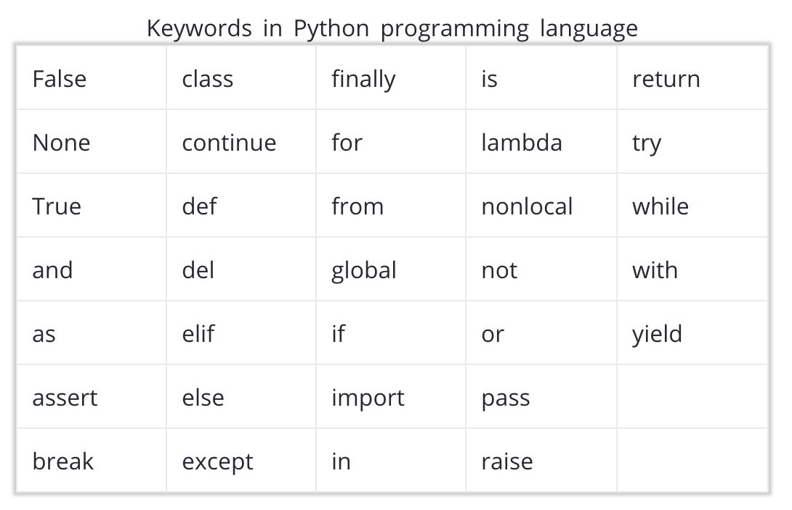

Python 中的数据类型和运算符
---

### 概述

- 数据类型：整型、浮点型、布尔型、字符串、列表、元组、集合、字典

- 运算符：算术、赋值、比较、逻辑、成员、恒等运算符

- 内置函数、符合数据结构、类型转换

- 空格和样式指南

---

### 变量

- 变量的定义

  ```Python
    students_num = 500
  ```

  说明：students_num 是变量，负责存储 500 的值。该表达式将右侧的项目赋值给左侧的名称，实际上和数学等式有所不同，因为 500 不存储 students_num 的值。

- 变量不同的赋值方式

  ```Python
    # 方式一
    x = 3
    y = 4
    z = 5

    # 方式二
    a, b, c = 3, 4, 5
  ```

- 变量命名的注意事项

  ```Python
  1. 只能在变量名称中使用常规字母、数字和下划线。不能包含空格，并且需要以字母或下划线开头。
  2. 不能使用保留字或内置标识符，它们在 Python 中具有重要含义。
  3. 在 python 中，变量名称的命名方式是全部使用小写字母，并用下划线区分单词。
  ```

### Python 中的保留字



### 整数和浮点数

- 数字值可以用到两种 python 数据类型

  ```
    int - 表示整数值
    float - 表示小数或浮点数值
  ```

- 以通过以下语法创建具有某个数据类型的值

  ```Python
  x = int(4.7)   # x is now an integer 4
  y = float(4)   # y is now a float of 4.0
  ```

- 使用函数 type 检查数据类型

  ```Python
  print(type(x)) # int
  print(type(y)) # float
  ```

- 其他：因为 0.1 的浮点数（或近似值）实际上比 0.1 稍微大些，当我们将好几个这样的值相加时，可以看出在数学上正确的答案与 Python 生成的答案之间有区别。

  ```Python
  print(.1 + .1 + .1 == .3) # False
  ``` 

- 编码规范说明：Python 最佳做法需要follow下面链接给出的PEP8 指南。每行代码应该不超过 80 个字符，虽然在某些使用情况下，99 个字符也可以。

### 整数和浮点数[相关练习]

- 辨别下列哪些是`整型`哪些是`浮点型`

  ```
  1. 有多少人参加了你的钓鱼之旅 **整型**
  2. 钓到的鱼的长度（以米计）**浮点型**
  3. 在钓鱼之旅中钓到的鱼条数 **整型**
  4. 钓到第一条鱼所花费的时间（以小时计）**浮点型**
  ```

- Python 中除以零的相关错误

  ```Python
  print(5 / 0)
  ```

  会出现如下错误：

  ```log
  Traceback (most recent call last):
    File "/*/*/code.py", line 1, in <module>
      print(5/0)

  ZeroDivisionError: division by zero
  ```

### 关于异常和语法错误

  ```
  1. 异常：是代码运行时发生的问题
  2. 语法错误：Python 在运行代码之前检查代码时发现的问题
  ```

### 算术运算符

- `+` 加
- `-` 减
- `*` 乘
- `/` 除
- `%` 取余（相除后的余数）
- `**` 取幂（注意 `^` 并不执行该运算，你可能在其他语言中见过这种情形）
- `//` 相除后向下取整到最接近的整数


### 算术运算符[相关练习]

- 在过去三个月的电费是 23 美元、32 美元和 64 美元。这三个月的每月平均电费是多少？

  ```Python
  print((23 + 32 + 64) / 3)
  ```

- 一个区域是宽 9 块砖，长 7 块砖，另一个区域是宽 5 块砖，长 7 块砖。一包砖有 6 块。
 * 需要多少块砖？
 * 如果购买 17 包砖，每包有 6 块砖。剩下多少块砖？

  ```Python
  # Fill this in with an expression that calculates how many tiles are needed.
  print(9*7 + 5*7)

  # Fill this in with an expression that calculates how many tiles will be left over.
  print(17*6 - (9*7 + 5*7))
  ```

### 赋值运算符


### 赋值运算符[相关练习]

- 这道练习的注释（以 # 开头的行）提供了创建和修改变量的说明。请在每条注释后面根据说明写一行代码。
[注意] 这段代码使用了科学记数法来定义很大的数字。`4.445e8` 等于 `4.445 * 10 ** 8`，也就是 `444500000.0`。

  ```Python
    # The current volume of a water reservoir (in cubic metres)
    reservoir_volume = 4.445e8
    # The amount of rainfall from a storm (in cubic metres)
    rainfall = 5e6

    # decrease the rainfall variable by 10% to account for runoff
    rainfall *= 1-0.1
    # add the rainfall variable to the reservoir_volume variable
    reservoir_volume += rainfall
    # increase reservoir_volume by 5% to account for stormwater that flows
    # into the reservoir in the days following the storm
    reservoir_volume *= 1+0.05
    # decrease reservoir_volume by 5% to account for evaporation
    reservoir_volume *= 1-0.05
    # subtract 2.5e5 cubic metres from reservoir_volume to account for water
    # that's piped to arid regions.
    reservoir_volume -= 2.5e5
    # print the new value of the reservoir_volume variable
    print(reservoir_volume)
  ```

- 思考下面代码的输出

  ```Python
    # 这是关于山景城人口和人口密度的原始数据。
    mv_population = 75000
    mv_area = 11.995
    mv_density = mv_population/mv_area
    print(int(mv_density)) # 6252
  ```

### 布尔型运算符、比较运算符和逻辑运算符

- 布尔数据类型存储的是值 `True` 或 `False`，通常分别表示为 `1` 或 `0`。

- 通常有 `6` 个比较运算符会获得布尔值：

  |符号使用情况|布尔型|运算符
  |---|----|-----
  | 5 < 3 |False|小于
  | 5 > 3 |	True |	大于
  | 3 <= 3 |	True |	小于或等于
  | 3 >= 5 |	False |	大于或等于
  | 3 == 5 |	False |	等于
  | 3 != 5 |	True |	不等于

- 需要熟悉的三个逻辑运算符

  |逻辑使用情况|布尔型|运算符
  |---|----|-----
  | 5 < 3 `and` 5 == 5	| False |	`and` - 检查提供的所有语句是否都为 True
  | 5 < 3 `or` 5 == 5	| True |	`or` - 检查是否至少有一个语句为 True
  | `not` 5 < 3	| True |	`not` - 翻转布尔值

### 布尔型运算符、比较运算符和逻辑运算符[相关练习]

- 哪个地区人口密度更高？里约还是旧金山？

  ```Python
  sf_population, sf_area = 864816, 231.89
  rio_population, rio_area = 6453682, 486.5

  san_francisco_pop_density = sf_population / sf_area
  rio_de_janeiro_pop_density = rio_population / rio_area

  # Write code that prints True if San Francisco is denser than Rio, and False otherwise
  print(san_francisco_pop_density > rio_de_janeiro_pop_density) # False
  ```

2. 为何 Python 使用 `==` 检查是否相等，而不是 `=`？

 * 因为 `=` 用来为变量赋值的

### 字符串

在 python 中，字符串的变量类型显示为 `str`。你可以使用双引号 `"` 或单引号 `'` 定义字符串

- 定义字符串

  ```Python
  my_string = 'this is a string!'
  my_string2 = "this is also a string!!!"

  # Also , we can use backslash '/' to escape quotes.
  this_string = 'Simon\'s skateboard is in the garage.'
  print(this_string)
  ```

- 字符串的常用操作

  ```Python
  first_word = 'Hello'
  second_word = 'There'
  print(first_word + second_word) # HelloThere
  print(first_word + ' ' + second_word) # Hello There
  print(first_word * 5) # HelloHelloHelloHelloHello
  print(len(first_word)) # 5

  print(first_word[0]) # H
  print(first_word[1]) # e
  ```

### 字符串[相关练习]

- 在字符串中正确的使用引号

  ```Python
  ford_quote = 'Whether you think you can, or you think you can\'t--you\'re right.'
  print(ford_quote) # Whether you think you can, or you think you can't--you're right.
  ```

- 下面这段代码的输出是什么？

  ```Python
  coconut_count = "34"
  mango_count = "15"
  tropical_fruit_count = coconut_count + mango_count
  print(tropical_fruit_count) # 3415 (并且 tropical_fruit_count 是字符串)
  ```

- 编写服务器日志消息 

  ```Python
  username = "Kinari"
  timestamp = "04:50"
  url = "http://petshop.com/pets/mammals/cats"

  # TODO: print a log message using the variables above.
  # The message should have the same format as this one:
  # "Yogesh accessed the site http://petshop.com/pets/reptiles/pythons at 16:20."
  print(username + ' accessed the site ' + url + ' at ' + timestamp + '.')
  ```

- 使用字符串连接和 `len` 函数计算某些电影明星的实际完整姓名的长度

  ```Python
  given_name = "William"
  middle_names = "Bradley"
  family_name = "Pitt"

  name_length = len(given_name + ' ' + middle_names + ' ' + family_name)

  # Now we check to make sure that the name fits within the driving license character limit
  # Nothing you need to do here
  driving_license_character_limit = 28
  print(name_length <= driving_license_character_limit) # True
  ```

- 我们刚刚使用函数 `len` 计算出字符串的长度。当我们向其提供整数 `835` 而不是字符串时，函数 `len` 会返回什么？

  ```
  Error
  ```

### 类型和类型转换

- 目前我们已经接触的数据类型

  ```
  1. 整型
  2. 浮点型
  3. 布尔型
  4. 字符串
  ```

- 使用 `type()` 用来检查你所处理的任何变量的数据类型

  ```Python
  print(type(4)) # int
  print(type(3.7)) # float
  print(type('this')) # str
  print(type(True)) # bool
  ```

### 类型和类型转换[相关练习]

- 你认为以下代码的结果是什么？

  ```Python
  "0" + 5
  ```

  将会报错：

  ```log
  Traceback (most recent call last):
    File "<stdin>", line 1, in <module>
  TypeError: must be str, not int
  ```

  or 

  ```Python
  0 + "5"
  ```

  将会报错：

  ```log
  Traceback (most recent call last):
    File "<stdin>", line 1, in <module>
  TypeError: unsupported operand type(s) for +: 'int' and 'str'
  ```

- 以下对象是什么类型：`"12"`

  ```
  str
  ```

- 以下对象是什么类型：`12.3`？

  ```
  float
  ```

- 以下对象是什么类型：`len("my_string")`？

  ```
  int
  ```

- 以下对象是什么类型：`"hippo" *12`？

  ```
  str
  ```

- 计算总销量

  ```Python
  mon_sales = "121"
  tues_sales = "105"
  wed_sales = "110"
  thurs_sales = "98"
  fri_sales = "95"

  #TODO: Print a string with this format: This week's total sales: xxx
  # You will probably need to write some lines of code before the print statement.
  total = int(mon_sales) + int(tues_sales) + int(wed_sales) + int(thurs_sales) + int(fri_sales)
  print("This week\'s total sales: " + str(total)) # This week's total sales: 529
  ```

### 字符串方法

- python 中的方法和函数相似，但是它针对的是你已经创建的变量。方法特定于存储在特定变量中的数据类型。


- 每个方法都接受字符串本身作为该方法的第一个参数。但是，它们还可以接收其他参数。我们来看看几个示例的输出。

  ```Python
  my_string = "sebastian thrun"
  my_string.islower() # True
  my_string.count('a') # 2
  my_string.find('a') # 3
  ```

- 可以看出，`count` 和 `find` 方法都接受另一个参数。但是，`islower` 方法不接受参数。如果我们要在变量中存储浮点数、整数或其他类型的数据，可用的方法可能完全不同！

### 字符串方法[相关练习]

- 对浮点型对象调用 `islower` 等方法会发生什么？例如 `13.37.islower()`

 * 会出现错误, 方法 `islower` 属于字符串方法，而不是浮点数方法。不同类型的对象具有特定于该类型的方法。例如，浮点数具有 `is_integer` 方法，而字符串没有。

- 练习字符串方法

  ```Python
  my_name = "my name is Joh."
  cap = my_name.capitalize()
  print(cap) # My name is joh.
  ew = my_name.endswith('li')
  print(ew) # False
  ind = my_name.index('is')
  print(ind) # 8
  ```

### 列表和成员运算符

- `列表`可以包含我们到目前为止所学的`任何数据类型`并且`可以混合`到一起。

  ```Python
  lst_of_random_things = [1, 3.4, 'a string', True] # 这是一个包含 4 个不同类型元素的列表
  print(lst_of_random_things[0]) # 1
  ```

- 获取上述列表的`第一个`值和`最后一个`值

  ```Python
  print(lst_of_random_things[0]) # 1
  print(lst_of_random_things[len(lst_of_random_things) - 1]) # True
  ```

- 此外，你可以使用负数从列表的末尾开始编制索引，其中 `-1` 表示最后一个元素，`-2` 表示倒数第二个元素，等等

  ```Python
  print(lst_of_random_things[-1]) # True
  print(lst_of_random_things[-2]) # a string
  ```

- 列表切片的应用: 我们可以使用切片功能从列表中提取多个值。在使用切片功能时，务必注意，`下限`索引包含`在内`，`上限`索引`排除在外`, 最终返回的是一个`新的列表`

  正常的用法：

  ```Python
  lst_of_random_things = [1, 3.4, 'a string', True]
  print(lst_of_random_things[1:2]) # [3.4]
  ```

  从列表的开头开始，也可以省略起始值

  ```Python
  lst_of_random_things = [1, 3.4, 'a string', True]
  print(lst_of_random_things[:2]) # [1, 3.4]
  ```

  要返回到列表结尾的所有值，可以忽略最后一个元素

  ```Python
  lst_of_random_things = [1, 3.4, 'a string', True]
  print(lst_of_random_things[1:]) # [3.4, 'a string', True]
  ```

- 在列表里还是不在列表里？关键字 `in` 和 `not in` 返回一个布尔值, 表示某个元素是否存在于列表中，或者某个字符串是否为另一个字符串的子字符串

  ```Python
  print('this' in 'this is a string') # True
  print('in' in 'this is a string') # True
  print('isa' in 'this is a string') # False
  print(5 not in [1, 2, 3, 4, 6]) # True
  print(5 in [1, 2, 3, 4, 6]) # False
  ```

- 列表的可变性和顺序

  > 可变性是指对象创建完毕后，我们是否可以更改该对象。如果对象（例如列表或字符串）可以更改，则是可变的。但是，如果无法更改对象以创建全新的对象（例如字符串），则该对象是不可变的。

  列表可变性测试：

  ```Python
  my_lst = [1, 2, 3, 4, 5]
  my_lst[0] = 'one'
  print(my_lst) # ['one', 2, 3, 4, 5]
  ```

  下面尝试修改字符串：

  ```Python
  greeting = "Hello there"
  greeting[0] = 'M'
  ```

  尝试修改字符串，引发如下错误：

  ```log
  Traceback (most recent call last):
    File "<stdin>", line 1, in <module>
  TypeError: 'str' object does not support item assignment
  ```

  但可以修改字符串对象的地址：

  ```Python
  greeting = "Hello there"
  greeting = 'Hi there'
  print(greeting) # Hi there
  ```

- 本节注意事项：
 * 对于你要使用的每种数据类型，你都需要注意两个事项：可变吗？有序吗？

### 列表和成员运算符[相关练习]

- 请使用列表索引根据整型变量 `month` 判断特定月份有多少天，并将该值存储在整型变量 `num_days` 中

  ```Python
  month = 8
  days_in_month = [31,28,31,30,31,30,31,31,30,31,30,31]

  # use list indexing to determine the number of days in month
  num_days = days_in_month[month - 1]

  print(num_days)
  ```

- 请使用列表切片记法从此列表中选择列表中的最后三个元素。提示：切片可以使用负索引！

  ```Python
  eclipse_dates = ['June 21, 2001', 'December 4, 2002', 'November 23, 2003',
                  'March 29, 2006', 'August 1, 2008', 'July 22, 2009',
                  'July 11, 2010', 'November 13, 2012', 'March 20, 2015',
                  'March 9, 2016']
                  
  # TODO: Modify this line so it prints the last three elements of the list
  print(eclipse_dates[-3:])
  ```

### 列表的常用方法

- 常用方法举例
 * `len()` 返回列表中的元素数量。
 * `max()` 返回列表中的最大元素。最大元素的判断依据是列表中的对象类型。数字列表中的最大元素是最大的数字。字符串列表中的最大元素是按照字母顺序排序时排在最后一位的元素。因为 `max()` 函数的定义依据是大于比较运算符。如果列表包含不同的无法比较类型的元素，则 `max()` 的结果是 undefined。
 * `min()` 返回列表中的最小元素。它是 `max()` 函数的对立面，返回列表中的最小元素。
 * `sorted()` 返回一个从最小到最大排序的列表副本，并使原始列表保持不变。
 * `join()` 将字符串列表作为参数，并返回一个由列表元素组成并由分隔符字符串分隔的字符串。
 * `append()` 实用方法 `append()` 会将元素添加到列表末尾。

- 方法实践举例之join()

  ```Python
  new_str = "\n".join(["fore", "aft", "starboard", "port"])
  print(new_str)
  ```

  Output: 在此示例中，我们使用字符串 "\n" 作为分隔符，以便每个元素之间都有一个换行符。我们还可以在 .join 中使用其他字符串作为分隔符。以下代码使用的是连字符。

  ```
  fore
  aft
  starboard
  port
  ```

  or 

  ```Python
  name = "-".join(["García", "O'Kelly"])
  print(name)
  ```

  Output:

  ```log
  García-O'Kelly
  ```

- 方法实践举例之append()

  ```Python
  letters = ['a', 'b', 'c', 'd']
  letters.append('z')
  print(letters)
  ```

  Output：

  ```log
  ['a', 'b', 'c', 'd', 'z']
  ```

### 列表的常用方法[相关练习]

- 以下代码的输出是什么？

  ```Python
  a = [1, 5, 8]
  b = [2, 6, 9, 10]
  c = [100, 200]

  print(max([len(a), len(b), len(c)])) # 4
  print(min([len(a), len(b), len(c)])) # 2
  ```

- 以下代码的输出是什么？

  ```Python
  names = ["Carol", "Albert", "Ben", "Donna"]
  print(" & ".join(sorted(names))) # Albert & Ben & Carol & Donna
  ```

- 以下代码的输出是什么？

  ```Python
  names = ["Carol", "Albert", "Ben", "Donna"]
  names.append("Eugenia")
  print(sorted(names)) # ['Albert', 'Ben', 'Carol', 'Donna', 'Eugenia']
  ```

### 参考链接

- https://en.wikipedia.org/wiki/History_of_Python
- https://wiki.python.org/moin/BitwiseOperators
- https://en.wikipedia.org/wiki/Operation_(mathematics)%E3%80%82
- https://pentangle.net/python/handbook/node52.html
- https://pentangle.net/python/handbook/node20.html
- https://en.wikipedia.org/wiki/Scientific_notation
- https://docs.python.org/3/tutorial/floatingpoint.html
- https://www.python.org/dev/peps/pep-0008/
- https://atom.io/packages/linter-python-pep8
- https://softwareengineering.stackexchange.com/questions/148677/why-is-80-characters-the-standard-limit-for-code-width
- https://docs.python.org/3/tutorial/errors.html
- https://docs.python.org/3/library/stdtypes.html#string-methods