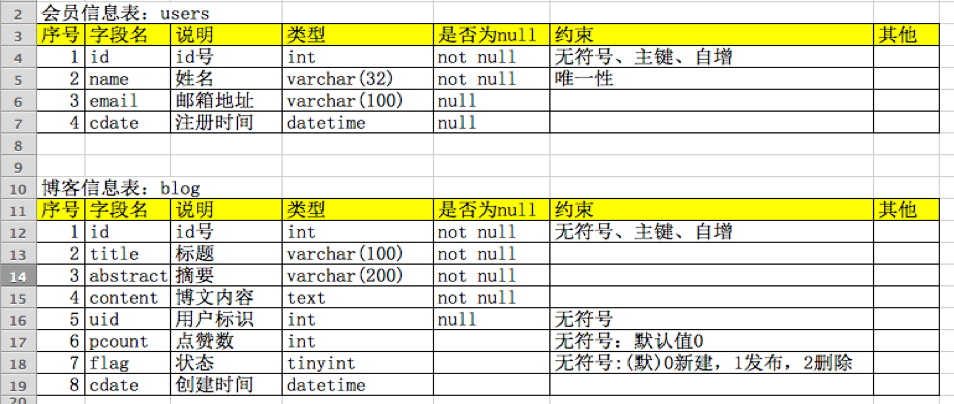

操作说明
---

练习sql案例, 在命令行模式下登录MySQL数据库，使用SQL语句

### 第一部分

- 创建留言数据库: blogdb;

```sql
create database if not exists blogdb;
```

- 在blogdb数据库中创建会员表users和博客文章表blog，结构如下



创建会员表users

```sql
create table users(
	id int unsigned not null auto_increment primary key,
	name varchar(32) not null unique,
	email varchar(100) default null,
	cdate datetime default null
);
```

博客文章(信息)表blog

```sql
create table blog(
	id int unsigned not null auto_increment primary key,
	title varchar(100) not null,
	abstract varchar(200) not null,
	content text not null,
	uid int unsigned default null,
	pcount int unsigned default 0,
	flag tinyint unsigned default 0,
	cdate datetime
);
```

- 在会员表users中添加>=5条的测试数据

```sql
# 批量添加数据 注意这里的 values 和 value
insert into users value(null, 'p1', 'p1@qq.com', '2019-2-1 11:11'), 
(null, 'p2', 'p2@qq.com', '2019-2-2 11:11'),
(null, 'p3', 'p3@qq.com', '2019-2-3 11:11'),
(null, 'p4', 'p4@qq.com', '2019-2-4 11:11'),
(null, 'p5', 'p5@qq.com', '2019-2-5 11:11');
```

- 在blog博文信息表中添加>=10条的测试数据

```sql
# 批量添加数据
insert into blog values(null, 'title1', 'abstract1', 'content1', 1, 10, 0, '2019-2-1 21:11'), 
(null, 'title2', 'abstrac2', 'content2', 2, 20, 0, '2019-2-2 21:11'),
(null, 'title3', 'abstract3', 'content3', 3, 30, 0, '2019-2-3 21:11'),
(null, 'title4', 'abstract4', 'content4', 4, 40, 0, '2019-2-4 21:11'),
(null, 'title5', 'abstract5', 'content5', 5, 50, 0, '2019-2-5 21:11'),
(null, 'title6', 'abstract6', 'content6', 6, 60, 0, '2019-2-6 21:11'),
(null, 'title7', 'abstract7', 'content7', 7, 70, 0, '2019-2-7 21:11'),
(null, 'title8', 'abstract8', 'content8', 8, 80, 0, '2019-2-8 21:11'),
(null, 'title9', 'abstract9', 'content9', 9, 90, 0, '2019-2-9 21:11'),
(null, 'title10', 'abstract10', 'content10', 10, 100, 0, '2019-2-10 21:11');
```

- 最后将blogdb数据库中的信息导出，并以blogdb.sql文件存储，具体查看文件内容

### 第二部分

- 在users表中查询注册时间最早的十条会员信息

```sql
# 默认按升序asc(可不写), desc是降序排列
select * from users order by cdate limit 10;
# 或如下方式，加asc关键字
select * from users order by cdate asc limit 10;
```

- 从两个表中查询点赞数最高的5条博客信息，要求显示字段：（博文id，标题，点赞数，会员名） 

```sql
select blog.id as bid, title, pcount, users.name as username from users left join blog on blog.uid = users.id order by pcount desc limit 5;
```

- 统计每个会员的发表博文数量（降序），要求显示字段（会员id号，姓名，博文数量）

```sql
select users.id as uid, name, blog.pcount from users left join blog on blog.uid = users.id order by pcount desc limit 5;
```

- 获取会员的博文平均点赞数量最高的三位。显示字段（会员id，姓名，平均点赞数）

```sql
select users.id as uid,name, avg(pcount) as avg_pcount from blog, users where users.id = blog.uid group by uid order by avg_pcount desc limit 3;
```

- 删除没有发表博文的所有会员信息

```sql
delete from users where id not in(select uid from blog);
```

### 第三部分

- 要求：使用自定义的数据库操作类，实现一个自动取款机的存取款模拟效果, 要求有登陆和退出、查询余额、取钱，存钱等操作, 账户信息存储到数据库中

- 解决方案点击[这里](./db-model)